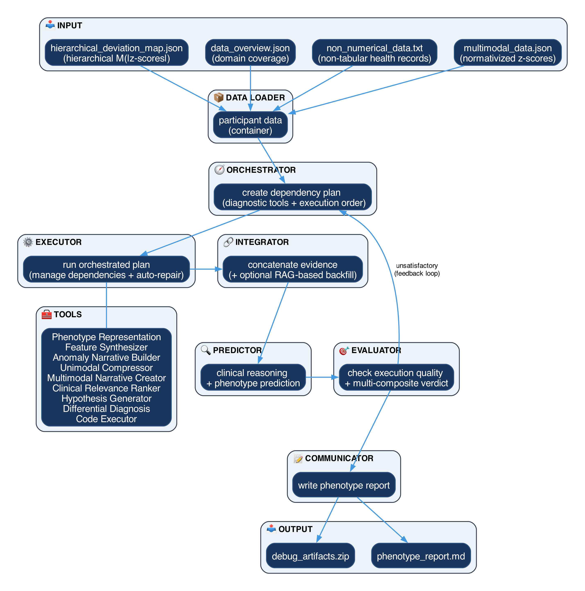

<div align="center">

# Clinical Ontology-driven Multi-modal Predictive Agentic Support System (COMPASS)

[](#)
[](https://www.gnu.org/licenses/gpl-3.0)
[](https://www.python.org/)
[](docker/)
<br>

**COMPASS** is a multi-agent decision support engine for deep phenotype prediction. It combines hierarchical multi-modal deviation maps, structured feature data, and non-tabular health information through an orchestrated actor-critic workflow, and supports binary classification, multiclass classification, univariate and multivariate regression, and hierarchical mixed task trees.

</div>

---

## Key features

- **Multi-agent orchestration**: an actor-critic workflow coordinates the Orchestrator, Executor, Integrator, Predictor, Critic, and Communicator.
- **Flexible prediction tasks**: typed task specifications cover classification, regression, and mixed hierarchical output trees.
- **Explainable clinical reasoning**: optional XAI methods and evidence chains connect predictions to source features and clinical narratives.
- **Live dashboard**: execution plans, agent progress, token usage, predictions, critic feedback, and generated reports.

## Architecture



The Executor runs independent tool steps concurrently against a hosted API, and sequentially against a self-hosted model to limit GPU memory pressure. After the final iteration COMPASS selects the strongest satisfactory attempt; if none is satisfactory it selects the highest-scoring attempt and records that status.

## Dashboard

A FastAPI service supervises each run as an isolated worker process and serves a React client on the same port: guided setup, task design for all five families, live cost projection, execution streamed over server-sent events with the plan drawn as a graph, an ontology explorer with per-participant and cohort views, reports on screen and as PDF, batch runs, and per-role control over models, budgets, and the system prompts.

```bash
npm --prefix src/full_stack/frontend install
npm --prefix src/full_stack/frontend run build
python3 main.py --ui
```

Served at http://127.0.0.1:5005. For client development run `npm --prefix src/full_stack/frontend run dev` alongside `python3 main.py --ui --quiet`; Vite serves on port 5173 and proxies `/api`.

## Install

Python 3.11+ runs the engine, Node 20+ builds the client.

```bash
git clone https://github.com/stvsever/multi_agent_decision_support_system.git
cd multi_agent_decision_support_system
python3 -m venv .venv && source .venv/bin/activate
python3 -m pip install -r requirements.txt
cp .env.example .env          # add OPENROUTER_API_KEY, or paste it in the dashboard
```

OpenRouter is the default backend and `deepseek/deepseek-v4-flash-0731` the default model for every role. Reasoning is off by default: reasoning tokens are billed as output and count against the output ceiling, so they can consume the budget and truncate the answer. A failed model, schema, or connection stops the run; COMPASS never substitutes a deterministic result for a failed one.

## Run in containers

All commands read `docker/.env`, so copy `docker/.env.example` first. Full detail in [docker/README.md](docker/README.md).

| You want | Command |
| --- | --- |
| Dashboard, hosted models | `docker compose -f docker/docker-compose.yml up --build` |
| API only, no web client | `docker compose -f docker/docker-compose.yml --profile api up --build` |
| One run, no server | `docker compose -f docker/docker-compose.yml --profile cli run --rm compass-cli <args>` |
| Self-hosted weights on GPU | `docker compose -f docker/docker-compose.gpu.yml up --build` |
| Model server only | `docker compose -f docker/docker-compose.gpu.yml up vllm` |

Set `COMPASS_DATA_DIR` to mount your participant folders at `/data`, and `COMPASS_RESULTS_DIR` for outputs. The self-hosted path scales from one GPU, to several on one node with `COMPASS_GPU_COUNT` and `COMPASS_VLLM_TP`, to several nodes on a Slurm cluster through [src/full_stack/backend/hpc](src/full_stack/backend/hpc/README.md), which prints the base URL to point COMPASS at. A self-hosted server is configured exactly like a hosted one, because both speak the OpenAI protocol.

## Usage

Each participant folder holds four files:

```text
data_overview.json   hierarchical_deviation_map.json   multimodal_data.json   non_numerical_data.txt
```

Synthetic samples ship under `src/full_stack/backend/data/pseudo_data/inputs/` and are discovered automatically. Run outputs go to `results/`.

```bash
# Offline audit: loading, payload construction, coverage, and chunking. No model is called.
python3 main.py src/full_stack/backend/data/pseudo_data/inputs/SUBJ_001_PSEUDO \
  --prediction_type binary --target_label target_phenotype \
  --control_label non_target_comparator --audit

# Full run
python3 main.py src/full_stack/backend/data/pseudo_data/inputs/SUBJ_001_PSEUDO \
  --prediction_type binary --target_label target_phenotype \
  --control_label non_target_comparator --backend openrouter
```

Other task modes take `--class_labels`, `--regression_output(s)`, or `--task_spec_file` for a hierarchical tree. `--xai_methods external,internal,hybrid` adds explainability, which currently covers root-level binary classification and records an explicit skip otherwise. `python3 main.py --help` lists every flag.

## Project structure

```text
multi_agent_decision_support_system/
├── docker/                     # Container definitions and compose files
├── src/
│   ├── full_stack/
│   │   ├── backend/
│   │   │   ├── agents/         # Agent implementations and prompts
│   │   │   ├── api/            # FastAPI service, run supervision, cost, PDF
│   │   │   ├── config/         # Runtime and model configuration
│   │   │   ├── data/           # Typed models and pseudo-data
│   │   │   ├── hpc/            # Slurm and Apptainer templates
│   │   │   ├── runtime/        # Engine event bus consumed by the dashboard
│   │   │   ├── tools/          # Clinical analysis tools and prompts
│   │   │   └── utils/          # Core engine, validation, XAI, and logging
│   │   └── frontend/           # React and Vite web client
│   └── tests/                  # Engine and dashboard unit tests
├── COMPASS_demo.ipynb          # End-to-end demonstration notebook
├── main.py                     # CLI and UI entry point
└── requirements.txt
```

## Status

An active research prototype. The actor-critic pipeline, task contracts, dashboard, container runtimes, and pseudo-data workflows are functional; work continues on stability, calibration, and reporting.

```bash
python3 -m pytest -q
```

> [!CAUTION]
> **PRE-CLINICAL DISCLAIMER**
> COMPASS is a research prototype and is not a certified medical device under the EU Medical Device Regulation or FDA requirements. Do not use it for primary diagnostic decisions. All outputs require review by qualified domain experts.
