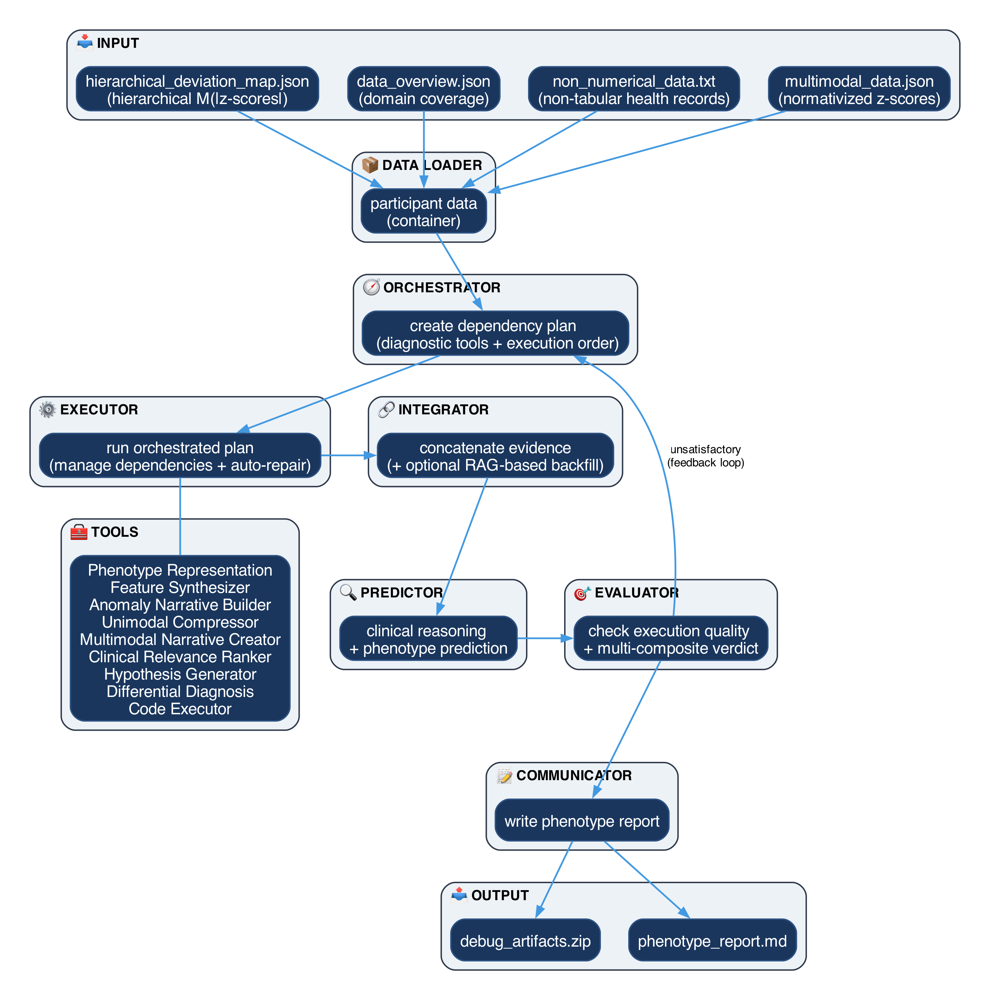

<div align="center">

# Clinical Ontology-driven Multi-modal Predictive Agentic Support System (COMPASS)

[](#)
[](https://www.gnu.org/licenses/gpl-3.0)
[](https://www.python.org/)
[](docker/)
<br>

**COMPASS** is a multi-agent decision support engine for deep phenotype prediction. It combines hierarchical multi-modal deviation maps, structured feature data, and non-tabular health information through an orchestrated actor-critic workflow, and supports binary classification, multiclass classification, univariate and multivariate regression, and hierarchical mixed task trees.

</div>

---

## 📖 Contents

- [🚀 Key features](#key-features)
- [🧠 Architecture](#architecture)
- [🔀 Evidence routing](#routing)
- [🧮 Structured decision models](#decision-models)
- [🖥️ Dashboard](#dashboard)
- [🛠️ Install](#install)
- [🐳 Run in containers](#containers)
- [⚡ Usage](#usage)
- [📋 Reference](#reference)
- [📁 Project structure](#structure)

## <a id="key-features"></a>🚀 Key features

- **Multi-agent orchestration**: an actor-critic workflow coordinates the Orchestrator, Executor, Integrator, Predictor, Critic, and Communicator.
- **Evidence routing**: a participant record that fits the Predictor input goes to it directly; a larger record is first distilled by the orchestration workflow.
- **Flexible prediction tasks**: typed task specifications cover classification, regression, and mixed hierarchical output trees.
- **Structured decision models**: the Predictor role can be served by a model that answers typed questions with probabilities instead of writing text, such as TypeSafe Jev.
- **Explainable clinical reasoning**: optional XAI methods and evidence chains connect predictions to source features and clinical narratives.
- **Live dashboard**: execution plans, agent progress, token usage, predictions, critic feedback, and generated reports.

## <a id="architecture"></a>🧠 Architecture



The Executor runs independent tool steps concurrently against a hosted API, and sequentially against a self-hosted model to limit GPU memory pressure. After the final iteration COMPASS selects the strongest satisfactory attempt; if none is satisfactory it selects the highest-scoring attempt and records that status.

## <a id="routing"></a>🔀 Evidence routing

Each attempt reaches the Predictor by one of two routes:

- **Direct**: the complete participant record (clinical notes, deviation map, data overview, and every feature leaf) goes to the Predictor in a compact, lossless rendering. The Orchestrator, Executor, and Integrator are not called.
- **Orchestrated**: the Orchestrator plans tool steps, the Executor runs them, and the Integrator fuses their outputs, extracting chunk evidence when needed, before the Predictor reads them.

Before the first attempt COMPASS builds the direct record and measures it against the Predictor's own input budget. Building and measuring it calls no model, except that a decision Predictor compiles its question book at this point, once per task.

| Predictor | What is measured | Budget |
| --- | --- | --- |
| LLM | Tokens of the complete direct-route prompt, system prompt included | Context window minus an output reserve, capped by `max_agent_input_tokens` |
| Structured decision model | cl100k tokens of the complete, unpacked decision state | The model's state limit converted to cl100k tokens, minus the longest question and a small margin |

The direct rendering (`utils/core/record_rendering.py`) lists every feature leaf once, as `label = value (z +1.23) [qualifiers such as a reference range]` under its ontology path, gives the deviation map as the score of every scored ontology group (a group's mean absolute deviation as `mean |z| 1.39`, which has no direction, and a signed score as `+1.39`; leaf scores already in the measurements are not repeated), and the data overview as one coverage line per domain. No leaf is summarised or left out (z-scores are printed with two decimals), and a large multimodal record takes several times fewer tokens than the generic JSON rendering, so far more records fit the Predictor directly.

| Mode | Route per attempt |
| --- | --- |
| `auto` (default) | Direct when the record fits the budget, orchestrated otherwise |
| `always` | Orchestrated, also when the record fits |
| `never` | Direct; a record that does not fit is fitted to the budget (an LLM prompt is truncated, a decision state is packed with its coverage recorded) |

`--orchestration_threshold N` replaces the budget with a fixed token count. It can lower the threshold, never raise it above what the Predictor accepts. In the dashboard the mode and the threshold are under Settings, Engine.

The orchestration workflow exists to fit a large record into a bounded Predictor input. A record that already fits loses nothing by going direct: the Predictor reads every value unabridged (the per-section caps that apply on the orchestrated route are lifted), and the attempt makes no planning, tool, or fusion calls.

When the Critic rejects an attempt, the next one depends on the route and on the Predictor:

| Rejected attempt | Next attempt |
| --- | --- |
| Orchestrated, any Predictor | Re-orchestrates: the Orchestrator plans again with the critic's feedback |
| Direct, LLM Predictor | Revises: the same complete record, with the critic's feedback appended to the Predictor prompt |
| Direct, decision Predictor | Escalates to the orchestrated route with the feedback, because a decision model shown the same state gives the same answers; in `never` mode, or when the only problem is an output without a measurement scale, the loop stops instead |

If the provider rejects a direct prompt as too long (its real context window is smaller than the configured one), the same attempt is rerun on the orchestrated route instead of failing, unless the mode is `never`. The Predictor's context window comes from the dashboard's cached provider catalog when available, then from a built-in table, then from the configured public window.

Attempt selection compares attempts across routes. Every attempt's route and the reason for it are recorded under `routing` (see [Reference](#reference)).

## <a id="decision-models"></a>🧮 Structured decision models

A structured decision model writes no text. It reads one JSON state, answers typed questions, and returns probabilities: a Noul gives the probability that a stated condition holds, a Choice a distribution over named options, and a Score a distribution over at most 10 ordered levels. COMPASS can use such a model as the Predictor; TypeSafe Jev (`typesafe/jev-1.13`) through the OpenRouter Decisions API is the reference. A decision Predictor returns the same `PredictionResult` as an LLM Predictor, so the critic loop, reports, dashboard, and saved outputs keep working.

### Predictor only, with a companion LLM

The Orchestrator, tools, Integrator, Critic, and Communicator write plans, syntheses, critiques, and reports, which a decision model cannot produce. A run with a decision model in any of those roles stops at start with an error naming the roles. They run on a conventional companion LLM:

- **CLI**: `--predictor_model typesafe/jev-1.13` changes the Predictor only; every other role keeps `--public_model`. When `--public_model` is itself a decision model, it becomes the Predictor and COMPASS asks on the terminal for the companion LLM (default `deepseek/deepseek-v4-flash-0731`, used without asking when standard input is not a terminal). `--companion_model` answers in advance.
- **Dashboard**: in Settings, Models and compute, pick the decision model in the Predictor row. Picking it as the default model, or for another role, opens a companion step instead: on confirm the decision model serves the Predictor and the conventional LLM chosen there becomes the default the other agents fall back to. While the Predictor is a decision model, a Decision model group in the same section holds the provider and question settings listed under [Reference](#reference).

When the Predictor is a decision model, the Orchestrator is told so and asked to plan steps that distil the record into compact evidence for every task output.

### From task to typed questions

**Question book.** Once per task, COMPASS writes for every node of the task tree one literal question, an operational definition per class label, and a measurement scale per regression output. Definitions and scales given in the task specification (`class_definitions`, `output_scales`) are used as given. The companion LLM writes the rest, and the question wording, from the task specification and the study context (`--global_instruction` and `--predictor_instruction`), never from participant data. The book is cached under `.compass_cache/decision_question_books/`, keyed by a hash of the task specification and the study context, and reused for every participant, so a cohort is scored with identical questions; parallel workers take a file lock, so one compiles and the others read its result. Every prediction records the book's content hash (`decision_report.question_book_hash`). A failed or incomplete compilation (a node without a compiled question, a class label still on the generic definition, or a regression output without a scale) is retried once; a book that is still incomplete keeps whatever was compiled, is never cached, and is compiled again on the next attempt. An output without a scale falls back to a standardized -3 to 3 scale, and the decision critic rejects the prediction until `output_scales` is defined or compilation succeeds; generic wording is reported as a weakness. Reference statistics that contradict a scale (a mean outside its range, an SD below a twentieth of it) are ignored with a note.

**Questions per request.**

| Task node | Questions |
| --- | --- |
| Binary classification | One label-neutral Noul per label ("does this participant belong to the '<label>' group?") plus the two-option Choice in both option orders |
| Multiclass classification | The Choice in up to `choice_orders` option orders (default 3): rotations, the last one reversed |
| Regression, per output | A Score over the output's range in ascending and descending level order; in a second request, a zoomed Score in both orders |
| Whole task, first request | One Noul: does the record hold enough evidence for this judgement? |

In a hierarchical or mixed tree every node, root and nested children alike, gets the questions of its own mode in the same request, and a multivariate node gets one pair of Scores per output. The answers are assembled into the same node tree an LLM Predictor returns.

**Order-robust ensembles.** Every judgement is asked in more than one presentation and the distributions are averaged at full precision. This removes the model's preference for the option shown first; for binary nodes, asking a Noul for each label also cancels any general lean toward "yes". The spread between presentations is kept as the instability of the node: for classification, the largest total variation distance between any two presentations, where the two Nouls of a binary node count as one presentation (their general lean toward "yes" cancels in the average and is reported separately as `yes_bias`); for regression, the largest gap between the ascending and descending means (coarse or refined) in reference standard deviations (the scale's `reference_sd`, or a sixth of its range, never less than a twentieth of it). Every answer is checked before use (a Noul must be a finite probability, a Choice must name the class labels, a Score must carry probability mass on its levels, keyed by index or by level text); an unusable answer is re-asked once and then treated as missing, never as a uniform answer. A node answered in only one orientation or order is flagged `unassessed` and counts as unstable; a node with no usable answers abstains (a uniform distribution, confidence 0), so the critic rejects the attempt instead of the run failing. Class labels that differ only by letter case are rejected. The predicted label is the one with the highest averaged probability. A Choice accepts at most 255 options; a larger node is rejected before any request.

### Continuous regression at full resolution

1. **Coarse pass**: the output's range is cut into `score_levels` levels (default 10): equal-width intervals for a continuous output, and contiguous, non-overlapping integer ranges for an integer output. Each level shows its interval and its position in words, relative to `reference_mean` and `reference_sd` when known and on the scale otherwise; the levels at the two ends of the whole scale also state what a low or high value means, when the scale defines it.
2. **Refinement pass**: the three adjacent coarse levels holding the most probability (ties go to the window centred on the most likely level) are cut into up to 10 finer levels and asked again, framed as "suppose the value is somewhere in this part of the range". A flat coarse answer, whose best window holds little more than its share of the levels, is not refined.

The refined distribution replaces the coarse window, scaled to its probability mass, which gives a piecewise-uniform density. Its mean is the point estimate, so the estimate is continuous and not snapped to a level centre. Its standard deviation and its 5th, 25th, 50th, 75th, and 95th percentiles are reported in `regression.uncertainty`. An integer output with at most `score_levels` possible values (a 0 to 6 item score, for example) gets one level per value and needs no refinement. `--no-decision_refine` keeps the coarse pass only.

### The state the model reads

| Section | Content | Route |
| --- | --- | --- |
| `task_context` | Study context and target definitions (the runtime instructions) | Both |
| `clinical_record` | Free-text notes | Both |
| `phenotype_synthesis` | Tool outputs of the workflow | Orchestrated |
| `chunk_evidence` | Per-chunk evidence rows | Orchestrated, when chunking ran |
| `measurements` | Every feature leaf with label, value and unit, and z-score, grouped by ontology path | Both |
| `deviation_profile` | Aggregate deviation of each ontology group | Both |

For Jev the state must fit 32,000 provider tokens (26,666 cl100k tokens at the default `tokenizer_ratio` of 1.2, less the longest question), and the state plus all questions of one request must fit 64,000. Packing starts from the complete sections and, only while the state is too large, walks a fixed ladder one step at a time (`PACKING_LADDER` in `decision/state.py`): first it shortens what the critic does not measure (the deviation profile, then the tool text and chunk rows, then drops the deviation profile, then shortens the study context), then it compacts the measurements by deviation, never at random: leaves with an absolute z below 0.5 are left out first, then below 1, 1.5, and 2, while leaves without a z-score are kept. Only after that are the chunk evidence, tool text, and clinical notes shortened further, and the chunk evidence and tool text dropped; the task context, clinical record, and measurements are never dropped. As a last resort the largest remaining section is truncated, repeatedly, until the state fits. A question set too large to share one request with the full state is split over several requests. If the provider still rejects the state as too long, it is repacked, each time to 80 percent of the previous budget, at most twice. `decision_report.state` records the rendering each section ended at and how many feature leaves the state holds, and lost feature leaves are listed as an uncertainty factor.

### Decision critic

A decision model writes no rationale for the LLM critic to judge, so its predictions go to a dedicated critic:

| Check | Rule |
| --- | --- |
| Schema | Every required node present, probabilities sum to 1 (within 0.05), labels valid, regression values finite, every regression output on a real measurement scale |
| Stability | Every node's instability at most its threshold: `stability_threshold` for classification (default 0.25, total variation) and `regression_stability_threshold` for regression (default 0.5 reference SD). `decision_report.quality` reports instability as a multiple of the threshold |
| Coverage | At least 90 percent of feature leaves in the state |
| Evidence sufficiency | Always reported; rejects only when `sufficiency_threshold` is above 0 (default 0) |
| Confidence | Reported, never a reason to reject |

Sufficiency is not gated by default because a record can be genuinely uninformative for a target, and no evidence route adds information the record does not hold. The composite score weighs schema 0.35, stability 0.25, sufficiency 0.20, coverage 0.10, and confidence 0.10. Instability and lost coverage are properties of the evidence the model was shown, which is why a rejected direct attempt escalates to the orchestrated route.

### Cost and limits

A decision model bills input tokens only: `typesafe/jev-1.13` is registered at 0.042 USD per million input tokens, with free output. An attempt makes one request, or two when a continuous regression output needs the refinement pass, not counting retries. The OpenRouter response carries the exact cost of each call; otherwise COMPASS computes it from the input tokens and the registered price. `decision_report.requests` lists each request's tokens, cost, and latency, and `decision_report.cost_usd` their total. The companion LLM is billed as usual: one question book compilation per task, plus any orchestrated attempts and reports.

- **No rationale**: `key_findings` lists the largest deviations in the record as context, not as the model's reasons, and `reasoning_chain` describes the procedure (route, state size, questions, instability).
- **XAI**: attribution methods (`--xai_methods`) are skipped with a recorded reason; the per-order answers and level distributions in `decision_details` are reported instead.
- **Reports**: the deep phenotype report still works, because the Communicator, an LLM, writes it from the prediction, the critic's evaluation, and the evidence.
- **Hosted only**: calls go to OpenRouter (`OPENROUTER_API_KEY`, default) or to the TypeSafe API (`--decision_provider typesafe`, `TYPESAFE_API_KEY`).

## <a id="dashboard"></a>🖥️ Dashboard

A FastAPI service supervises each run as an isolated worker process and serves a React client on the same port: guided setup, task design for all five families, live cost projection, execution streamed over server-sent events with the plan drawn as a graph, an ontology explorer with per-participant and cohort views, reports on screen and as PDF, batch runs, and per-role control over models, budgets, and the system prompts.

```bash
npm --prefix src/full_stack/frontend install
npm --prefix src/full_stack/frontend run build
python3 main.py --ui
```

Served at http://127.0.0.1:5005. For client development run `npm --prefix src/full_stack/frontend run dev` alongside `python3 main.py --ui --quiet`; Vite serves on port 5173 and proxies `/api`.

## <a id="install"></a>🛠️ Install

Python 3.11+ runs the engine, Node 20+ builds the client.

```bash
git clone https://github.com/stvsever/multi_agent_decision_support_system.git
cd multi_agent_decision_support_system
python3 -m venv .venv && source .venv/bin/activate
python3 -m pip install -r requirements.txt
cp .env.example .env          # add OPENROUTER_API_KEY, or paste it in the dashboard
```

OpenRouter is the default backend and `deepseek/deepseek-v4-flash-0731` the default model for every role. Reasoning is off by default: reasoning tokens are billed as output and count against the output ceiling, so they can consume the budget and truncate the answer. A failed model, schema, or connection stops the run; COMPASS never substitutes a deterministic result for a failed one.

## <a id="containers"></a>🐳 Run in containers

All commands read `docker/.env`, so copy `docker/.env.example` first. Full detail in [docker/README.md](docker/README.md).

| You want | Command |
| --- | --- |
| Dashboard, hosted models | `docker compose -f docker/docker-compose.yml up --build` |
| API only, no web client | `docker compose -f docker/docker-compose.yml --profile api up --build` |
| One run, no server | `docker compose -f docker/docker-compose.yml --profile cli run --rm compass-cli <args>` |
| Self-hosted weights on GPU | `docker compose -f docker/docker-compose.gpu.yml up --build` |
| Model server only | `docker compose -f docker/docker-compose.gpu.yml up vllm` |

Set `COMPASS_DATA_DIR` to mount your participant folders at `/data`, and `COMPASS_RESULTS_DIR` for outputs. The self-hosted path scales from one GPU, to several on one node with `COMPASS_GPU_COUNT` and `COMPASS_VLLM_TP`, to several nodes on a Slurm cluster through [src/full_stack/backend/hpc](src/full_stack/backend/hpc/README.md), which prints the base URL to point COMPASS at. A self-hosted server is configured exactly like a hosted one, because both speak the OpenAI protocol.

## <a id="usage"></a>⚡ Usage

Each participant folder holds four files:

```text
data_overview.json   hierarchical_deviation_map.json   multimodal_data.json   non_numerical_data.txt
```

A leaf in `multimodal_data.json` may carry its measured `value` and `unit` next to `feature` and `z_score`; both reach the Predictor unless the feature label already states the value. Synthetic samples ship under `src/full_stack/backend/data/pseudo_data/inputs/` and are discovered automatically. Run outputs go to `results/`.

```bash
# Offline audit: loading, payload construction, coverage, and chunking. No model is called.
python3 main.py src/full_stack/backend/data/pseudo_data/inputs/SUBJ_001_PSEUDO \
  --prediction_type binary --target_label target_phenotype \
  --control_label non_target_comparator --audit

# Full run
python3 main.py src/full_stack/backend/data/pseudo_data/inputs/SUBJ_001_PSEUDO \
  --prediction_type binary --target_label target_phenotype \
  --control_label non_target_comparator --backend openrouter
```

Other task modes take `--class_labels`, `--regression_output(s)`, or `--task_spec_file` for a hierarchical tree. `--xai_methods external,internal,hybrid` adds explainability, which currently covers root-level binary classification and records an explicit skip otherwise. `--predictor_model` and `--orchestration` choose the Predictor model and the evidence route (see [Reference](#reference)). `python3 main.py --help` lists every flag.

## <a id="reference"></a>📋 Reference

### Predictor and routing flags

| Flag | Default | Effect |
| --- | --- | --- |
| `--predictor_model ID` | `--public_model` | Model for the Predictor role only: a conventional LLM or a structured decision model |
| `--companion_model ID` | `--public_model` | Conventional LLM for every role except the Predictor. When `--public_model` is a decision model and this flag is missing, COMPASS asks on a terminal and otherwise uses `deepseek/deepseek-v4-flash-0731` |
| `--orchestration MODE` | `auto`, or `COMPASS_ORCHESTRATION` | `auto`, `always`, or `never` (see [Evidence routing](#routing)) |
| `--orchestration_threshold N` | Predictor budget | Token count above which `auto` orchestrates; it cannot exceed the Predictor budget |
| `--decision_provider NAME` | `openrouter`, or `COMPASS_DECISION_PROVIDER` | Transport for decision model calls: `openrouter` or `typesafe` |
| `--decision_choice_orders N` | 3 | Option orders per multiclass Choice; binary nodes always use both orders plus a Noul |
| `--decision_score_levels N` | 10 | Levels per regression Score, 2 to 10 |
| `--decision_refine`, `--no-decision_refine` | on | Zoomed second Score pass for continuous regression outputs |

```bash
# Structured decision model as the Predictor; every other role keeps --public_model
python3 main.py src/full_stack/backend/data/pseudo_data/inputs/SUBJ_001_PSEUDO \
  --prediction_type binary --target_label target_phenotype \
  --control_label non_target_comparator --predictor_model typesafe/jev-1.13

# Decision model given as --public_model, with the companion LLM named instead of asked
python3 main.py src/full_stack/backend/data/pseudo_data/inputs/SUBJ_001_PSEUDO \
  --prediction_type binary --target_label target_phenotype \
  --control_label non_target_comparator \
  --public_model typesafe/jev-1.13 --companion_model deepseek/deepseek-v4-flash-0731

# Orchestrate every attempt, also when the record fits the Predictor input
python3 main.py src/full_stack/backend/data/pseudo_data/inputs/SUBJ_001_PSEUDO \
  --prediction_type binary --target_label target_phenotype \
  --control_label non_target_comparator --orchestration always
```

From Python, `run_compass_pipeline(..., orchestration_mode="never", orchestration_threshold_tokens=None)` overrides the routing settings for one run; `None` keeps the configured value.

### Task specification fields

Two optional fields on any task node make the target explicit. `class_definitions` maps each class label to a one-sentence operational definition. `output_scales` maps each regression output to its scale: `min` and `max` (the instrument's possible range; a scale without both is compiled instead), `integer`, `unit`, `description`, `low_meaning`, `high_meaning`, `reference_mean`, and `reference_sd`. An LLM Predictor reads them as part of the task specification; for a decision Predictor they take precedence over what the companion LLM compiles.

```json
{
  "schema_version": "1.0",
  "task_id": "depression_profile",
  "root": {
    "node_id": "diagnosis",
    "display_name": "Major depressive disorder",
    "mode": "binary_classification",
    "class_labels": ["MDD", "CONTROL"],
    "class_definitions": {
      "MDD": "Meets DSM-5 criteria for a current major depressive episode.",
      "CONTROL": "No current or lifetime psychiatric diagnosis."
    },
    "children": [
      {
        "node_id": "severity",
        "display_name": "Depression severity",
        "mode": "univariate_regression",
        "regression_outputs": ["madrs_total"],
        "output_scales": {
          "madrs_total": {
            "min": 0, "max": 60, "integer": true, "unit": "points",
            "description": "MADRS total score",
            "low_meaning": "no depressive symptoms",
            "high_meaning": "very severe depression"
          }
        }
      }
    ]
  }
}
```

### Output fields

| Field | Where | Content |
| --- | --- | --- |
| `regression.uncertainty` | Regression nodes | Per output: `mean`, `sd`, `q05`, `q25`, `median`, `q75`, `q95`; filled by a decision Predictor, whose `values` hold the mean |
| `decision_details` | Every node | Per-order answers, instability, level distributions, and, on the root, evidence sufficiency |
| `predictor_kind`, `predictor_model` | Prediction result | `llm` or `decision`, and the model id |
| `input_route` | Prediction result, pipeline return value | `direct` or `orchestrated` |
| `decision_report` | Prediction result | Model, route, question book, questions asked, `state` (packing and coverage), `requests` (tokens, cost, latency), `cost_usd`, `input_tokens`, `quality` (evidence sufficiency, mean and max instability, mean confidence, feature coverage, per node), and settings |
| `decision_stable`, `evidence_sufficient` | Critic checklist | The decision critic's stability and sufficiency checks |
| `routing` | Performance report, pipeline return value | `mode`, `initial` (tokens, budget, threshold source, reason), `attempts` (route per attempt, escalations marked), `selected_route` |
| `predictor` | Performance report | `kind`, `model`, `companion_model` |
| `decision` | Performance report | The selected prediction's `decision_report` |

The performance report is `performance_report_<participant_id>.json` in the run's output folder. The dashboard event stream carries a `ROUTE` event per attempt with the same route record.

### Settings and environment

| Setting | Default | Meaning |
| --- | --- | --- |
| `orchestration.mode` | `auto` | Routing mode |
| `orchestration.threshold_tokens` | 0 | Fixed routing threshold; 0 uses the Predictor budget |
| `decision.provider` | `openrouter` | Decision model transport |
| `decision.choice_orders` | 3 | Option orders per multiclass Choice |
| `decision.score_levels` | 10 | Levels per regression Score |
| `decision.regression_refine` | true | Zoomed second Score pass |
| `decision.stability_threshold` | 0.25 | Largest accepted probability shift between two presentation orders (classification) |
| `decision.regression_stability_threshold` | 0.5 | Largest accepted gap between level orders, in reference SDs (regression) |
| `decision.sufficiency_threshold` | 0.0 | Evidence sufficiency gate; 0 reports without gating |
| `decision.tokenizer_ratio` | 1.2 | Provider tokens per cl100k token, used to keep the state inside the model's limit |
| `decision.request_timeout_seconds` | 120 | Timeout per decision request |
| `decision.max_retries` | 3 | Tries per request on connection errors, rate limits, and transient server errors |
| `decision.compiler_model` | Orchestrator model | Companion LLM that writes the question book |

Both groups live in `src/full_stack/backend/config/settings.py` as `OrchestrationConfig` (`settings.orchestration`) and `DecisionConfig` (`settings.decision`). For a decision model, `settings.effective_context_window(model)` returns its state budget in cl100k tokens.

| Variable | Effect |
| --- | --- |
| `COMPASS_ORCHESTRATION` | Default routing mode (`auto`, `always`, `never`) |
| `COMPASS_DECISION_PROVIDER` | Default decision transport (`openrouter`, `typesafe`) |
| `COMPASS_DECISION_ENDPOINT` | Replaces the OpenRouter Decisions URL (default `https://openrouter.ai/api/alpha/decisions`) |
| `COMPASS_CACHE_DIR` | Root of the question book cache (default `.compass_cache/` in the repository) |
| `TYPESAFE_API_KEY` | Key for the TypeSafe route (`https://api.typesafe.ai/v1/systemone`) |

The registry knows `typesafe/jev-1.13` and `typesafe/jev-latest`; any other `typesafe/jev-*` id, except the Jev Router, is treated as a Jev-class model with the 1.13 limits until `register_decision_model()` registers it.

## <a id="structure"></a>📁 Project structure

```text
multi_agent_decision_support_system/
├── docker/                     # Container definitions and compose files
├── src/
│   ├── full_stack/
│   │   ├── backend/
│   │   │   ├── agents/         # Agent implementations and prompts
│   │   │   ├── api/            # FastAPI service, run supervision, cost, PDF
│   │   │   ├── config/         # Runtime and model configuration
│   │   │   ├── data/           # Typed models and pseudo-data
│   │   │   ├── decision/       # Structured decision models in the Predictor role
│   │   │   ├── hpc/            # Slurm and Apptainer templates
│   │   │   ├── runtime/        # Engine event bus consumed by the dashboard
│   │   │   ├── tools/          # Clinical analysis tools and prompts
│   │   │   └── utils/          # Core engine, validation, XAI, and logging
│   │   └── frontend/           # React and Vite web client
│   └── tests/                  # Engine and dashboard unit tests
├── COMPASS_demo.ipynb          # End-to-end demonstration notebook
├── main.py                     # CLI and UI entry point
└── requirements.txt
```

Evidence routing and structured decision models, under `src/full_stack/backend/`:

| Path | Responsibility |
| --- | --- |
| `utils/core/record_rendering.py` | The compact, lossless record rendering shared by the direct-route LLM prompt and the decision state |
| `utils/core/input_routing.py` | The direct-route executor output (`build_direct_executor_output`), the route decision (`decide_route`, `RouteDecision`) |
| `decision/registry.py` | Which model ids are decision models, with their limits and prices |
| `decision/client.py` | Transport to the OpenRouter Decisions API or the TypeSafe API, retries, per-call cost |
| `decision/questions.py` | Question book compilation and cache, typed question sets per request |
| `decision/scales.py` | Regression outputs as ordered levels, refinement window, density mean, sd, and quantiles |
| `decision/state.py` | State sections, their renderings, and the packer |
| `decision/aggregate.py` | Answers to node predictions: order ensembles, instability, distributions |
| `decision/predictor.py` | `DecisionPredictor`, the Predictor agent on a decision model |
| `decision/quality.py` | The decision critic |

> [!CAUTION]
> **PRE-CLINICAL DISCLAIMER**
> COMPASS is a research prototype and is not a certified medical device under the EU Medical Device Regulation or FDA requirements. Do not use it for primary diagnostic decisions. All outputs require review by qualified domain experts.
