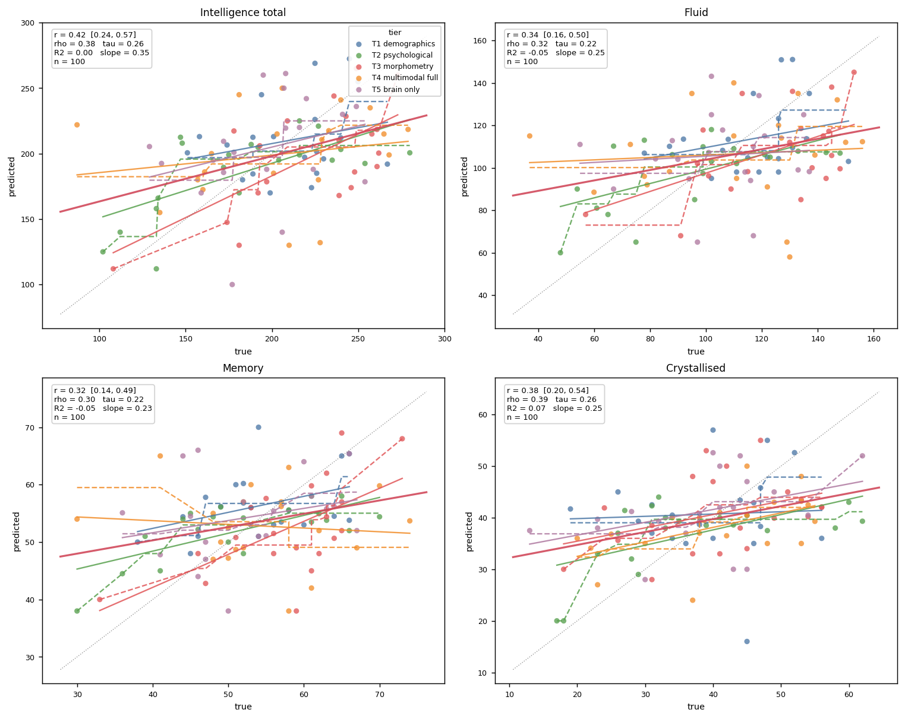
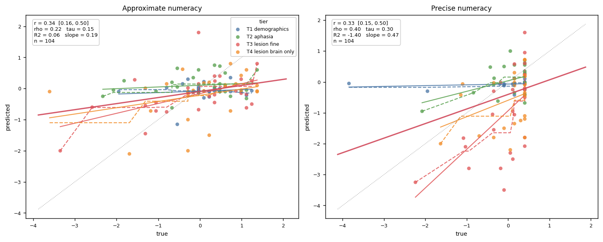
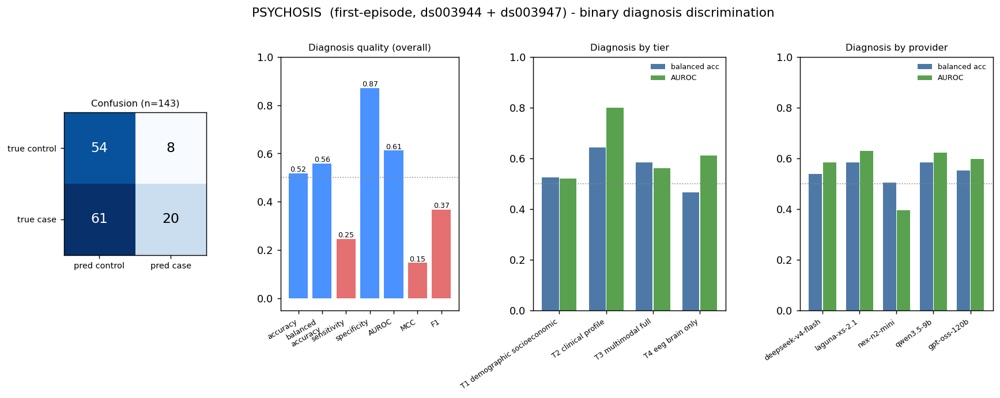
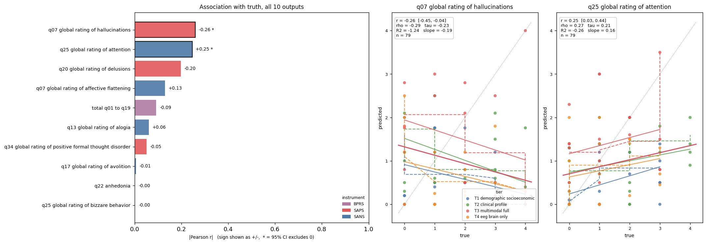
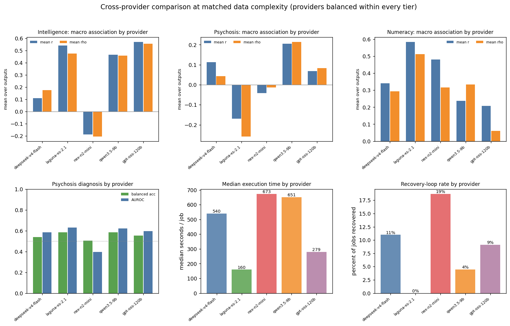
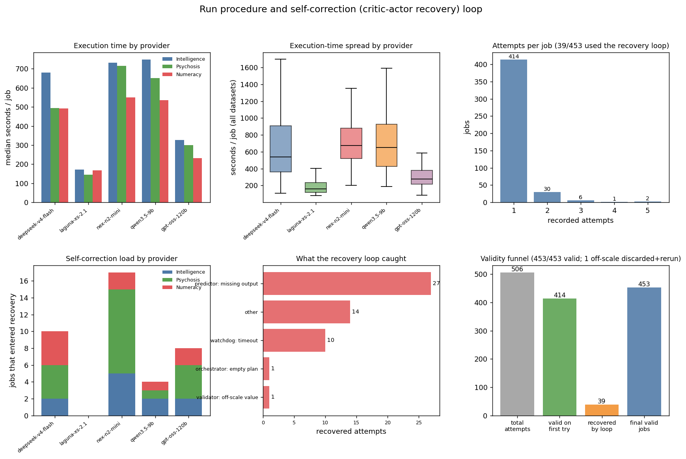

# OpenNeuro full-validation results

Generated from the completed seeded validation design on 2026-07-24. This file
summarizes the same canonical `predictions.json` / `summary.json` that the
notebook's section 9 reads; the notebook has the full pre-run analysis,
including every figure below fully annotated and interpreted.

## Completion and validity

All 453 planned jobs completed with a structurally valid prediction:

| Dataset | Subjects | Tasks | Valid jobs |
|---|---:|---:|---:|
| INTELLIGENCE | 100 | 1 | 100/100 |
| PSYCHOSIS | 143 | 1 | 143/143 |
| NUMERACY | 105 | 2 | 210/210 |

The design used seed `20260723`, temperature `0.0`, one assigned tier per
subject, and the five-provider panel recorded in `summary.json`. The full run
had no dollar cap. OpenRouter usage increased from $151.080000 to $158.332657,
for a recorded full-run cost of $7.252657.

Final validation rejected any missing, non-numeric, non-finite, off-scale, or
invalid-label output. It also checked exact dataset and provider allocations
and rejected conflicting duplicate job keys. The final accepted set contains
no such violations.

## Predictive results

Every regression figure below shows, per data-complexity tier, a solid line
for that tier's own linear (Pearson) fit and a dashed line for that tier's own
monotonic (Spearman-flavored, isotonic) fit, both in that tier's own color and
restricted to its own x-range. The thick red line is the pooled OLS fit across
all tiers; the thin grey dotted line is the identity reference (perfect
prediction).

### Intelligence

All four IST outputs rank subjects positively (Pearson r 0.32 to 0.42, every
95% interval above 0), strongest for the total composite. R2 sits near or
below 0 and slopes run about 0.25 to 0.35, so predictions are compressed
toward the population mean rather than spanning each subject's true range;
r and R2 disagree here for exactly that reason.

| Output | n | MAE | RMSE | Bias | Pearson r | Spearman rho |
|---|---:|---:|---:|---:|---:|---:|
| Crystallised | 100 | 8.777 | 10.754 | 0.396 | 0.381 | 0.392 |
| Fluid | 100 | 22.389 | 27.413 | -3.956 | 0.342 | 0.318 |
| Total | 100 | 34.812 | 42.824 | -4.201 | 0.420 | 0.378 |
| Memory | 100 | 7.479 | 9.588 | -0.553 | 0.323 | 0.299 |

Signal is highest for the T2 psychological and T3 morphometry tiers and
weakest for the multimodal-full and brain-only tiers; by provider it is
strongest for gpt-oss-120b, laguna-xs-2.1 and qwen3.5-9b and negative for
nex-n2-mini (see `figures/intelligence_association.png` for the full tier x
provider breakdown). Tier and provider cells hold different subjects, so
these are descriptive, not a controlled comparison.

### Numeracy

Both numeracy tasks (predicted on the population-Z scale) show modest signal:

| Output | Evaluable n | MAE | RMSE | Bias | Pearson r | Spearman rho |
|---|---:|---:|---:|---:|---:|---:|
| Approximate numeracy | 104 | 0.734 | 0.965 | -0.095 | 0.344 | 0.222 |
| Precise numeracy | 104 | 0.729 | 1.042 | -0.404 | 0.335 | 0.403 |

Precise-numeracy predictions are systematically lower than ground truth (R2
about -1.4), so its ranking is usable while its absolute level is not. One
job per task lacks an evaluable ground-truth target, so metric denominators
are 104 even though all 105 predictions per task are structurally valid.
Signal is clearly highest at the T3 fine-lesion tier for both outputs, and
among providers laguna-xs-2.1 and nex-n2-mini lead.

### Psychosis

Diagnosis performance is:

| n | Accuracy | Balanced accuracy | Sensitivity | Specificity | AUROC |
|---:|---:|---:|---:|---:|---:|
| 143 | 0.517 | 0.559 | 0.247 | 0.871 | 0.612 |

The large sensitivity-specificity gap shows a strong tendency to predict the
control class (MCC 0.15). Discrimination is best in the T2 clinical-profile
tier (balanced accuracy 0.643, AUROC 0.798) and near chance for the
demographic-only and EEG-brain-only tiers. These are between-subject cells
and should not be read as a causal ablation result.

Symptom-score metrics use the 79 subjects with available targets, and the
ten outputs are noisy and inconsistent in sign at this sample size, so
instead of ten scatter panels they get a forest plot of `|Pearson r|` (sign
shown as +/-) for all ten, plus full scatter detail only for the two whose
95% interval excludes zero:

| Output | MAE | Bias | Pearson r |
|---|---:|---:|---:|
| BPRS total | 17.319 | -9.009 | -0.092 |
| SAPS hallucinations | 1.706 | -0.760 | -0.259 |
| SAPS delusions | 1.912 | -1.403 | -0.197 |
| SAPS bizarre behavior | 1.107 | -0.392 | -0.002 |
| SAPS thought disorder | 1.093 | -0.298 | -0.051 |
| SANS affective flattening | 1.089 | -0.618 | 0.130 |
| SANS alogia | 0.981 | -0.310 | 0.061 |
| SANS avolition | 1.679 | -0.974 | -0.006 |
| SANS anhedonia | 1.669 | -0.935 | -0.002 |
| SANS attention | 1.059 | -0.475 | 0.246 |

Only hallucinations (r = -0.26, the wrong direction) and attention (r = +0.25,
the right direction) individually clear a 95% interval excluding zero; the
other eight are statistically indistinguishable from no association at
n = 79. Combined with broadly negative bias across the set, these ten
outputs are not adequate for any clinical use.

## Tier and provider observations

Because this is a seeded between-subject design rather than a within-subject
ablation, none of the tier or provider differences below alone establishes
that adding a modality causes performance to improve or worsen. Provider
cells contain different randomly assigned subjects, so they are useful
monitoring summaries, not direct head-to-head model rankings.

- Poolside's laguna-xs-2.1 was both the fastest provider (median about
  160 s/job) and needed no recovery in any dataset.
- Nex-agi's nex-n2-mini was the slowest and entered recovery most often
  (19% of its jobs), and its macro association is negative for intelligence
  and near zero elsewhere.
- Full tier x provider heatmaps and macro bars for each dataset are in
  `figures/intelligence_association.png`, `figures/numeracy_association.png`,
  and `figures/psychosis_association.png` (the last in absolute Pearson r,
  for the same noisy-sign reason as the forest plot above).

## Recovery and execution audit: the critic-actor self-correction loop

COMPASS runs each subject through an orchestrator, an actor (predictor) and a
critic, then a whole-pipeline guard validates the harvested prediction and
reruns the job on its assigned provider if anything is missing, non-finite,
off-scale, or an invalid label. The accepted predictions were never clipped
or filled with fabricated values.

- 414 of 453 jobs were valid on the first attempt; the remaining 39 were all
  recovered by a whole-pipeline retry, for 453/453 final validity.
- Two additional failed-cache rows are preserved in `summary.json` and
  matched to a valid prediction recovered in an isolated shard.
- A GPT NUMERACY prediction of `-22.0` for `sub-048` was rejected because it
  was outside the declared `[-5, 5]` population-Z range. The job was rerun
  and its valid replacement, `0.01`, is the only version in the accepted set.
- Predictor schema validation was moved inside the LLM retry loop so a
  syntactically valid response that omitted a required multivariate output
  was not accepted.

**Does needing the recovery loop change accuracy?** Pooling all three
datasets' subject-level error (each already scaled by its own output's
population SD, so comparable across datasets), a Mann-Whitney U test
comparing the 354 first-try subject-tasks against the 33 recovered ones gives
p = 0.31: no detectable accuracy difference (see
`figures/procedure_vs_performance.png`). Recovery restores structural
validity without a measurable accuracy cost, and execution time or retry
count is not a usable proxy for prediction quality in this run (per-dataset
Pearson r between seconds and error is within +-0.05 in all three, p > 0.6).

Poolside had the shortest median execution times in every dataset and no
recorded recovered jobs. Nex required the most recovery in PSYCHOSIS
(10 jobs with attached prior failures; median 714.9 seconds). These execution
figures describe this run and provider state, not intrinsic model reliability.

## Limitations

- This is one seeded validation run. Provider behavior and hosted model
  versions can change.
- Temperature `0.0` reduces sampling variability but does not make remote
  inference, tool execution, or provider routing perfectly deterministic.
- Tier and provider comparisons are between subjects. A within-subject design
  is required for a clean modality ablation or paired provider comparison.
- Ground-truth availability limits some metrics: 104/105 per NUMERACY task and
  79/143 for PSYCHOSIS symptom scores.
- Recovery was based only on execution and output validity, never on whether a
  prediction agreed with hidden truth. Predictive weaknesses therefore remain
  visible in the reported metrics.
- No per-iteration tool-call trace was serialized for this run, so the
  recovery-loop analysis above uses recorded attempts, typed attempt errors,
  and execution time; it cannot see how many tool calls happened inside a
  single attempt.
- These outputs are research validation results, not clinical predictions for
  care decisions.

## Artifacts

- `predictions.json`: all 453 accepted job records.
- `predictions_tidy.csv`: long-form diagnosis and regression predictions.
- `*_predictions.csv`: dataset-specific long-form predictions.
- `metrics/`: overall, tier, provider, and normalized-error tables.
- `figures/`: two figures per dataset (`<dataset>_predictions.png`,
  `<dataset>_association.png`), plus `psychosis_diagnosis.png`,
  `run_procedure.png`, `procedure_vs_performance.png`, and
  `cross_provider.png`.
- `execution_by_dataset_model.csv`: timing, attempt, and recovery summary.
- `summary.json`: design, spend, counts, metrics, invalid-discard record, and
  recovery audit.
